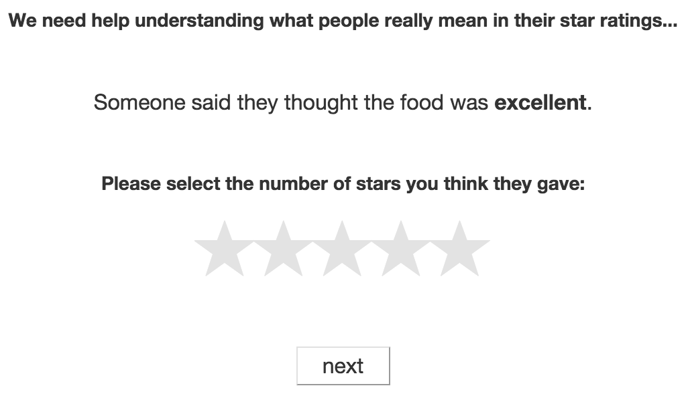

```{r load_data, results="hide", message=FALSE, warning=FALSE}
rm(list = ls())
setwd("/Users/benpeloquin/Desktop/Projects/scalar_implicature/models")
source("../analysis/useful_dplyr.R")
library(rjson)
library(ggplot2)
library(MASS)
library(jsonlite)
library(tidyr)
```

# Pragmatics / implicature introduction

## Rational Speech-act theory

## Extending RSA to scalar implicature

# Experimental investigations / star rating paradigm

## Literal listener studies
<center>

</center>


## Can we elicit literal listener semantics for scalar items?

Using the paradigm described in the `star rating paridigm` setting we attempted to elicit literal listener semantics. Let's read in the data and get acquanted.
```{r}
l0.listener = read.csv("model_data/L0_e8.csv")
str(l0.listener)
head(l0.listener)
```
Data from each literal listener study:

`scale`: The scale we're currently investigating (i.e. "good_excellent").

`degree`: Valence of the current scalar item (i.e. in the scale `good_excellent` the scalar item `good` has degree `low` and `excellent` has degree `hi`).

`stars`: Number of stars the subject was presented

`cih` and `cil`: lower and upper 95% confidence intervals on the probability average number of positive judgments

`cnt.judgment`: Count of positive responses (`yes`) signalling compatibility between a scalar item and a star rating.

`speaker.p`: Estimated probability of a speaker believing a given scalar items is compatible with a presented star rating.

### Literal Listener study - two scalar items

We can approximate `literal listener` semantics as a distribution over star ratings.
```{r message=FALSE, warning=FALSE}
qplot(x = stars, y = speaker.p, col = degree,
      geom = "line", stat = "identity", position = "dodge",
      main = "Scalar compatibility with star ratings \n Experiment L0_e8",
      ylab = "P(Word | Rating)",
      data = l0.listener) +
  geom_linerange(aes(ymin = speaker.p - cil, 
                     ymax = speaker.p + cih)) + 
  facet_wrap(~scale)
```

### Literal Listener study - Full scale from empirically derived alternatives
```{r}
l0.listener2 = read.csv("model_data/L0_e10.csv")
str(l0.listener2)
head(l0.listener2)
```

`literal listener` semantics with full distribution over ratings.
```{r message=FALSE, warning=FALSE}
qplot(x = stars, y = speaker.p, col = degree,
      geom = "line", stat = "identity", position = "dodge",
      main = "Scalar compatibility with star ratings \n Experiment L0_e10",
      ylab = "P(Word | Rating)",
      data = l0.listener2) + 
  geom_linerange(aes(ymin = speaker.p - cil, 
                     ymax = speaker.p + cih)) + 
  facet_wrap(~scale)
```

We might be concerned that `literal listener` semantic distributions between experiments one (partial scale) and two (full scale) are different. Given our experimental design in which respondents are exposed to all scalar items (target scalars  and alternatives) the presence of alternatives might influence responses. If this is the case we'd expect to see significant differences in our estimates of the literal listener semantic distributions between experiments.

Let's plot the scalar semantics for matched items between the two studies.
```{r message=FALSE, warning=FALSE}
# subset of full (alts exp) that match first literal listener exp
subset.l2 = which((l0.listener2[, "scale"] != "some_all" &
        (l0.listener2[, "degree"] == "hi2" | l0.listener2[, "degree"] == "hi1")) |
       (l0.listener2[, "scale"] == "some_all" &
          (l0.listener2[, "degree"] == "hi1" | l0.listener2[, "degree"] == "low1")))
      
l0.listener2.match = l0.listener2[subset.l2,]
l0.listener2.match$degree = ifelse(l0.listener2.match$degree == "hi1", "hi", "low")
l0.listener2.match$exp = "full"
l0.listener$exp = "partial"
match.scalars = rbind(l0.listener2.match, l0.listener)

qplot(x = stars, y = speaker.p, colour = exp,
      geom = "line", stat = "identity", position = "dodge", 
      main = "Literal listener semantics estimates \nfor matched items",
      ylab = "P(Word | Rating)",
      data = match.scalars) + 
  geom_linerange(aes(ymin = speaker.p - cil, 
                     ymax = speaker.p + cih)) + 
  facet_wrap(~scale+degree)
```

Formal test of distributional differences:
```{r}
match.scalars$n.exp = ifelse(match.scalars$exp == "partial", 0, 1)
summary(glm(n.exp ~ scale + degree + stars + speaker.p, data=match.scalars))
head(match.scalars)

```

### Description

### Results

## How to find alternatives?

Under the Gricean framework, scalar implicature occurs because of the presence of salient alternatives. That is, we would not enrich `some` to `some, but not all` if `all` was not somehow also present. This goes back to the suggested mechanism of inference - if a listener assumes a speaker is being cooperative... FILL THIS IN.

Let's return to the scalar items `some` and `all`. Levinson (1983) proposes (http://web.stanford.edu/class/linguist236/implicature/materials/ling236-handout-04-23-scalars.pdf)...

Building off a framework used by van Tiel (2014) we presented participants with a target scalar item and asked a free-response question (limited to one word): "If the person had felt differently what is another word they could have used?".

which implicature arises (in this framework). If a listener assumes a speaker is cooperative and obeying the maxims 
```{r multiplot(), echo=FALSE}
multiplot = function(..., plotlist=NULL, file, cols=1, layout=NULL) {
  library(grid)

  # Make a list from the ... arguments and plotlist
  plots <- c(list(...), plotlist)

  numPlots = length(plots)

  # If layout is NULL, then use 'cols' to determine layout
  if (is.null(layout)) {
    # Make the panel
    # ncol: Number of columns of plots
    # nrow: Number of rows needed, calculated from # of cols
    layout <- matrix(seq(1, cols * ceiling(numPlots/cols)),
                    ncol = cols, nrow = ceiling(numPlots/cols))
  }

 if (numPlots==1) {
    print(plots[[1]])

  } else {
    # Set up the page
    grid.newpage()
    pushViewport(viewport(layout = grid.layout(nrow(layout), ncol(layout))))

    # Make each plot, in the correct location
    for (i in 1:numPlots) {
      # Get the i,j matrix positions of the regions that contain this subplot
      matchidx <- as.data.frame(which(layout == i, arr.ind = TRUE))

      print(plots[[i]], vp = viewport(layout.pos.row = matchidx$row,
                                      layout.pos.col = matchidx$col))
    }
  }
}
```

```{r, fig.width=16, fig.height=30, warning=FALSE}
# Code from e9_altsAnalysis.Rmd
d1 = fromJSON("../analysis/edited_alts.json", simplifyDataFrame=T)
d1 = as.data.frame(d1, stringsAsFactors = FALSE)

d <- d1 %>% 
  gather(base, alt, 
         palatable, liked, good, loved, some, all, 
         delicious, excellent, memorable, unforgettable) %>%
  mutate(base = as.character(base)) %>%
  rowwise %>%
  mutate(scale = ifelse(base == "some" | base == "all", "some_all", 
                        ifelse(base == "palatable" | base == "delicious", "palatable_delicious",
                               ifelse(base == "liked" | base == "loved", "liked_loved",
                                      ifelse(base == "good" | base == "excellent", 
                                             "good_excellent", "memorable_unforgettable"))))) %>%
  group_by(scale, alt) %>%
  summarise(n = n())

# Plot findings of salient alternatives for each scale
# -------------------------------------------------------
scales = unique(d$scale)
p1 = ggplot(data=d[d$scale==scales[1],], aes(x=reorder(alt, -n), y=n)) +
  geom_bar(stat="identity") + ylim(0, 50) + labs(x = "alternative", y = "counts") +
  ggtitle(paste("Salient alternatives for ", scales[1])) +
  theme(axis.text.x = element_text(angle = 90, hjust = 1))
p2 = ggplot(data=d[d$scale==scales[2],], aes(x=reorder(alt, -n), y=n)) +
  geom_bar(stat="identity") + ylim(0, 50) + labs(x = "alternative", y = "counts") +
  ggtitle(paste("Salient alternatives for ", scales[2])) +
  theme(axis.text.x = element_text(angle = 90, hjust = 1))
p3 = ggplot(data=d[d$scale==scales[3],], aes(x=reorder(alt, -n), y=n)) +
  geom_bar(stat="identity") + ylim(0, 50) + labs(x = "alternative", y = "counts") +
  ggtitle(paste("Salient alternatives for ", scales[3])) +
  theme(axis.text.x = element_text(angle = 90, hjust = 1))
p4 = ggplot(data=d[d$scale==scales[4],], aes(x=reorder(alt, -n), y=n)) +
  geom_bar(stat="identity") + ylim(0, 50) + labs(x = "alternative", y = "counts") +
  ggtitle(paste("Salient alternatives for ", scales[4])) +
  theme(axis.text.x = element_text(angle = 90, hjust = 1))
p5 = ggplot(data=d[d$scale==scales[5],], aes(x=reorder(alt, -n), y=n)) +
  geom_bar(stat="identity") + ylim(0, 50) + labs(x = "alternative", y = "counts") +
  ggtitle(paste("Salient alternatives for ", scales[5])) +
  theme(axis.text.x = element_text(angle = 90, hjust = 1))

multiplot(p1, p2, p3, p4, p5, cols=1)
```
Clearly some interesting differences between scalar sets. In particular, responses for scales such as `some_all` and `liked_loved` appear to have more clearly defined set of alternatives with high responses for alternatives such as `none` (XX responses) or `most`. Conversely, scales such as `memorable_unforgettable` and `palatable_delicious` have a much longer tail of possible alternatives, with less cleary defined top competitors.

Explanation / Investigation of these differences?

## Description


## Pragmatic listener studies

Our `Literal Listener` experimental design involves presenting participants with a star rating and asking for a judgment on the compatibility of a target scalar term with that rating using a binary (yes/no) dependent variable.  While these distributions differ from what we might have proposed from a purely logical interpretation of literal listener semantics (i.e. `some` entails "at least one" and is uniformily compatible across all star ratings >= 1) we do capture the intuition that `some` has some compatibility across all ratings >= 1, but that this compatibility is graded across star ratings, not uniform.

Can we also capture pragmatic enrichment in this current paradigm? Rational Speech-act theory frames language understanding as a special case of social cognition (Goodman & Stuhmuller, 2013) in which a listener must reason about a speaker who must reason about a listener (with an eventual grounding out of the recursion). In order to capture this iterated reasoning process we'll need to extend our paradigm so that participants must consider *what someone else might have meant by an utterance*. This is equivalent to capturing the posterior quantity we're interesed in:

$$p(meaning | utterance)$$

With a slight modification to our current paradigm, we can get estimates of this posterior distribution. Instead of presenting participants with a star rating and target scalar item and ask for a compatbility judgment, we ask participants to reason about the possible meaning of a given scalar term given a speaker utterance. Meaning is again quantified through star ratings.


<center>

</center>


### Description

### Results

# Formalizing Grice / RSA / Bayesian model

## Current model description

## Implementation

# Connecting experiments and model

## Baseline model performance

## Miniumum alternatives model

## Eliciting alternatives experiment

### Description

### Results

## Full model (alternatives) performance

#Conclusions